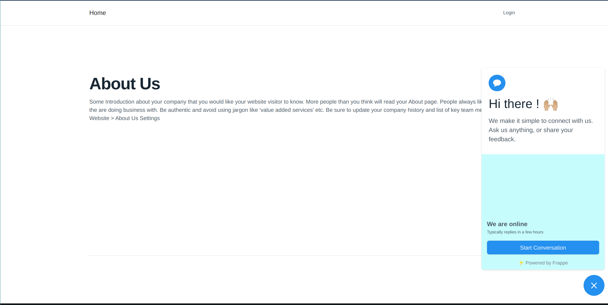
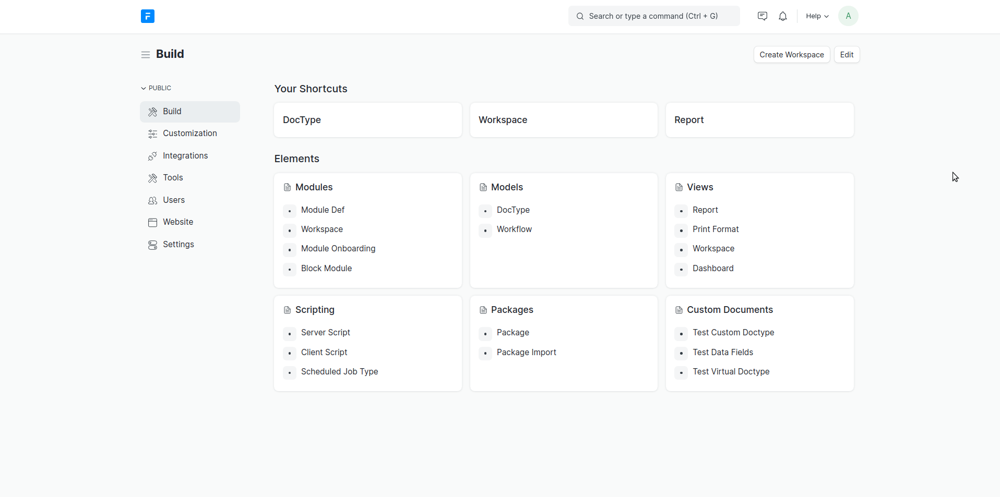
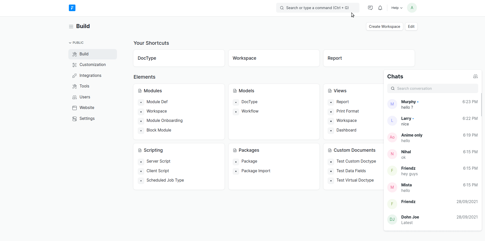
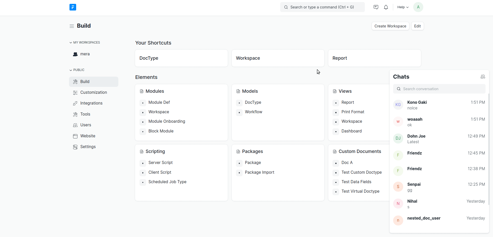
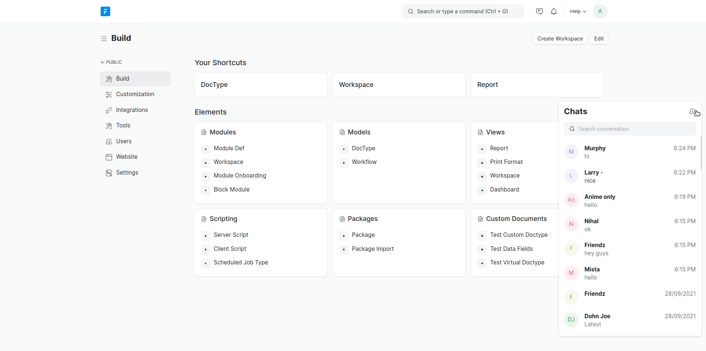

<br>
<div align="center">

</div>
<br>

# Frappe Chat


Modern Chat application for the Frappe ecosystem.

Supports Frappe version 13 and develop.

## Table of Contents

- [Features](#features)
- [Installation](#installation)
- [Usage](#usage)
- [License](#license)

## Features

1. Intuitive and modern UI/UX
2. REST architecture
3. Very lightweight
4. Mobile First
5. Guest and Admin view
6. Dark mode support
7. All functionalities of a chat app

## Installation

1. Get the app from the repository.

   ```
   bench get-app chat
   ```

2. Install the app on your site.
   ```
   bench --site your-site.local install-app chat
   ```

## Usage

1. On the portal pages, the guest will be prompted with this view.

   

2. The guest will have to fill a form and after that they will be prompted to the chatting space.

   

3. You can click the message icon on the navbar to open the chat admin view.

   

4. Click on any room and start chatting right away.

   

5. Chat with any user on the site.

   

6. Create any private room.

   

7. You can configure the required application settings in chat settings doctype.

   

## License

MIT
